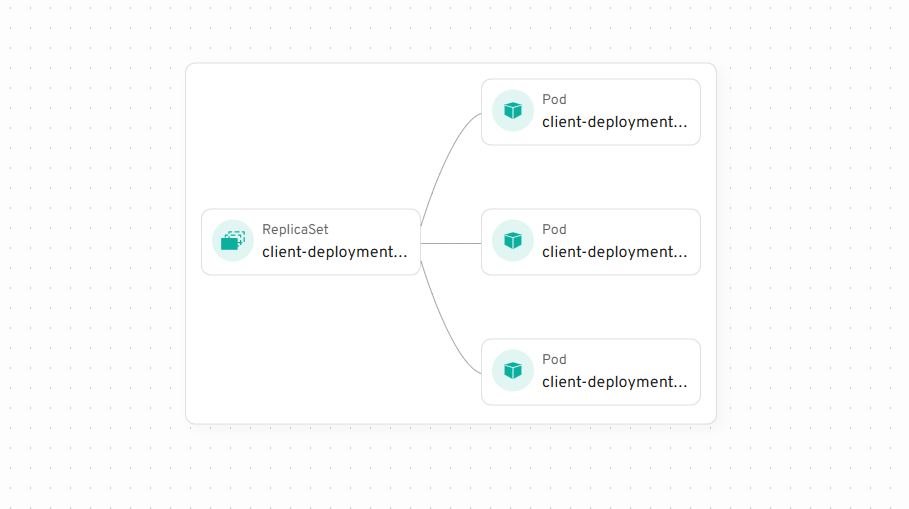
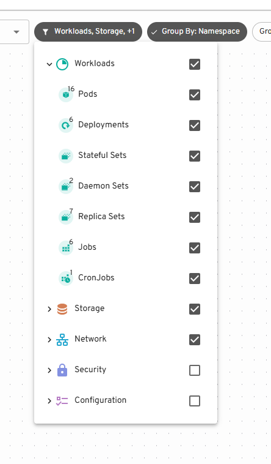
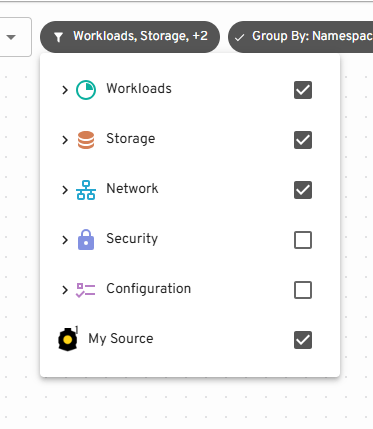
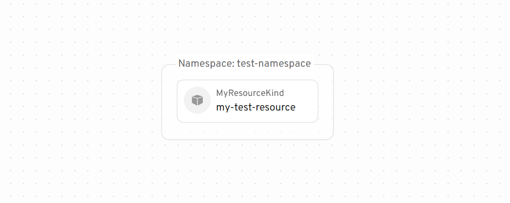
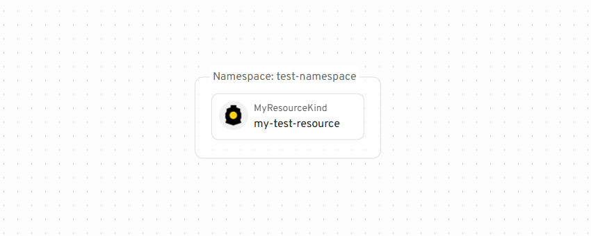

Map view displays cluster resource on a graph. Plugins can extend this graph by adding nodes and edges.

## Nodes, edges and sources

**Node** represents a Kubernetes resource. **Edges** connect different **nodes**, for example ReplicaSet connects to Pods it owns.

<figure>



<figcaption>1 ReplicaSet and 3 Pods it owns</figcaption>
</figure>

To add your own nodes and edges you need to define a **Source**

A graph **Source** represents a collection of Nodes and Edges along with name and icon. Source may contain other Sources.

<figure style="text-align: center">



<figcaption>Example: "Pods" is a source that contains Nodes for all the Pods in the cluster, "Workloads" is also a source containing other Sources.</figcaption>
</figure>

## Creating and registering a Source

To define a Source create an object with the following structure:

```tsx
const mySource = {
  id: "my-source", // ID of the source should be unique
  label: "My Source", // label will be displayed in source picker
  // you can provide an icon
  icon: (
    
  ),
  /**
   * useData is a hook that will be called to load nodes and edges for your source
   * You can use hooks here that Headlamp provides to load Kubernetes resources
   * this hook should return an object with nodes and edges or `null` if it's loading
   * it's important that return object is not recreated every time, so useMemo is required
   */
  useData() {
    return useMemo(() => {
      // This would come from kubernetes API but it's hardcoded here as an example
      const myResource = {
        kind: "MyResourceKind",
        metadata: {
          uid: "1234",
          name: "my-test-resource",
          namespace: "test-namespace",
          creationTimestamp: "1234",
        },
      };

      const edges = []; // no edges in this source
      const nodes = [
        {
          id: "1234", // ID should be unique
          type: "kubeObject", // 'kubeObject' type represnets a kubernetes resource
          data: {
            // resource field is required and should contain KubeObject
            resource: new KubeObject(myResource),
          },
          // Optionally provide a custom details component to be shown when node is selected
          detailsComponent: ({ node }) => {
            return (
              <div>
                <h2>Custom Details View</h2>
                <p>This is a custom details view for: {node.data.resource.metadata.name}</p>
              </div>
            );
          },
        },
      ];

      return { edges, nodes };
    }, []);
  },
};
```

Then to register it call `registerMapSource`

```tsx
registerMapSource(mySource);
```

You'll now see it in the Source picker and the Node on the Map:

<figure style="text-align: center">



<figcaption>"My Source" is listed on the bottom. Enabled by default.</figcaption>
</figure>

<figure style="text-align: center">



<figcaption>MyCustomResource Node displayed with default Icon</figcaption>
</figure>

## Node Icons

To add an icon to the Node you need to call `registerKindIcon`.

Note: This is different from the Source icon. One Source may contain multiple different kinds of objects.

```tsx
registerKindIcon("MyCustomResource", {
  // icon is a JSX element
  icon: ,
});
```

<figure style="text-align: center">



<figcaption>Node with a custom Icon</figcaption>
</figure>

## Custom Detail Views

When a node is selected on the map, its details are shown in a side panel. By default, if the node represents a Kubernetes resource (has `kubeObject` property), Headlamp will show the standard resource details view.

You can override this behavior by providing a custom details component:

```tsx
const myNode = {
  id: "custom-node",
  label: "Node with custom details",
  detailsComponent: ({ node }) => {
    return (
      <div>
        <h2>Custom Details</h2>
        <p>This is a custom details view for: {node.label}</p>
        {/* You can access any node property here */}
        <pre>{JSON.stringify(node.data, null, 2)}</pre>
      </div>
    );
  },
};
```

The details component receives the node object as a prop, giving you access to all node properties including any custom data you added to the `data` field.

This is useful when you want to:
- Show custom visualizations for your resources
- Display data from external sources alongside Kubernetes resources
- Create interactive detail views specific to your use case
